# Geography 485L/585L Milestones #

These *milestone* assignments will be compiled into an online, web-based *portfolio* that you will develop over the course of the semester. This portfolio will include a "home page" (started in the second week's milestone) that includes links to all of the created milestone and ["deep dive"](../deep-dives/deep-dives.html) pages that you will create. 

## Week 1 - Creating your first web page in GitHub ##

Developing content to go onto the web has evolved from a solitary effort to one where teams work together in developing components of larger web sites. These teams need to have a variety of tools to enable their work. Some of the most important tools enable code sharing with the team, and in projects based on the [Open Source](http://opensource.org/osd-annotated) software model the rest of the world. The [GitHub](https://github.com/) web platform uses the [Git](http://git-scm.com/) distributed [version control](http://en.wikipedia.org/wiki/Revision_control) system to enable sharing of code and hosting static web pages based on that shared code. 

We will be using GitHub as the platform for hosting your portfolios for the class, allowing you to learn how version control operates, and how to provide comments and keep notes on your work and the work of others (this will be part of our peer review process).

While the work we do this and next week will be directly through the editor integrated into the GitHub system, you will eventually want to install one of the recommended desktop applications that allow you to develop your web pages on your local computer and then update the files on the GitHub system when you want to create a new version. Also, you can't add things like images to your web pages until you are adding them to a local repository on your computer and then sending them to GitHub. 

### Create a GitHub Account and Public Repository for the Class ###

Step 1

:	Go to the [GitHub](https://github.com/) web site and sign up for an account by providing a username, email address and password and submitting the requested information by clicking the "Sign up for GitHub" button. 

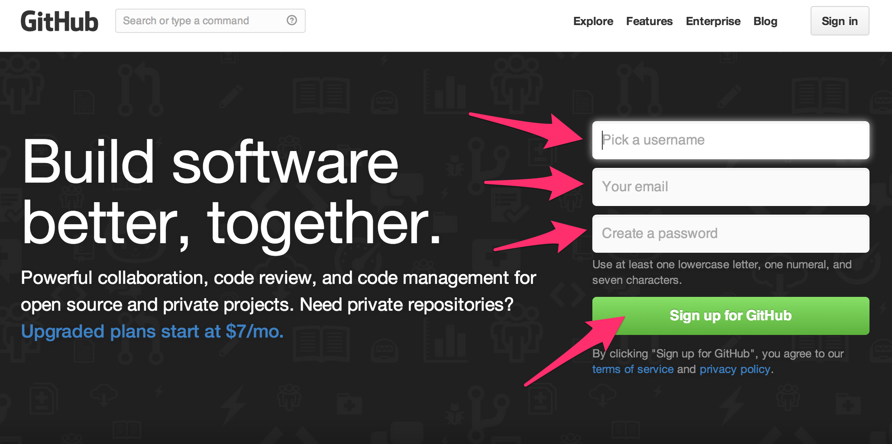

You will then be taken to the "Welcome to GitHub" page where you can see that you have signed up for a free GitHub account. 

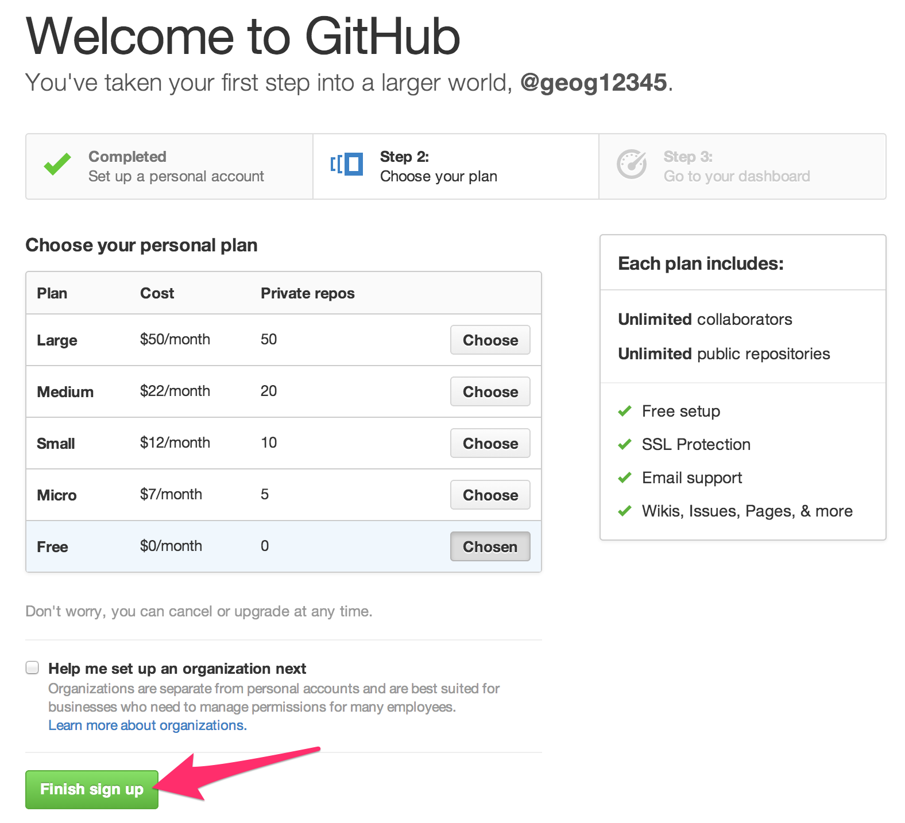

Step 2

:	Click the "Finish sign up" button near the bottom of the page. 

This takes you to your GitHub dashboard from which you can access all the information about your account. *Feel free to review the GitHub Bootcamp materials that are highlighted on your home page*. 

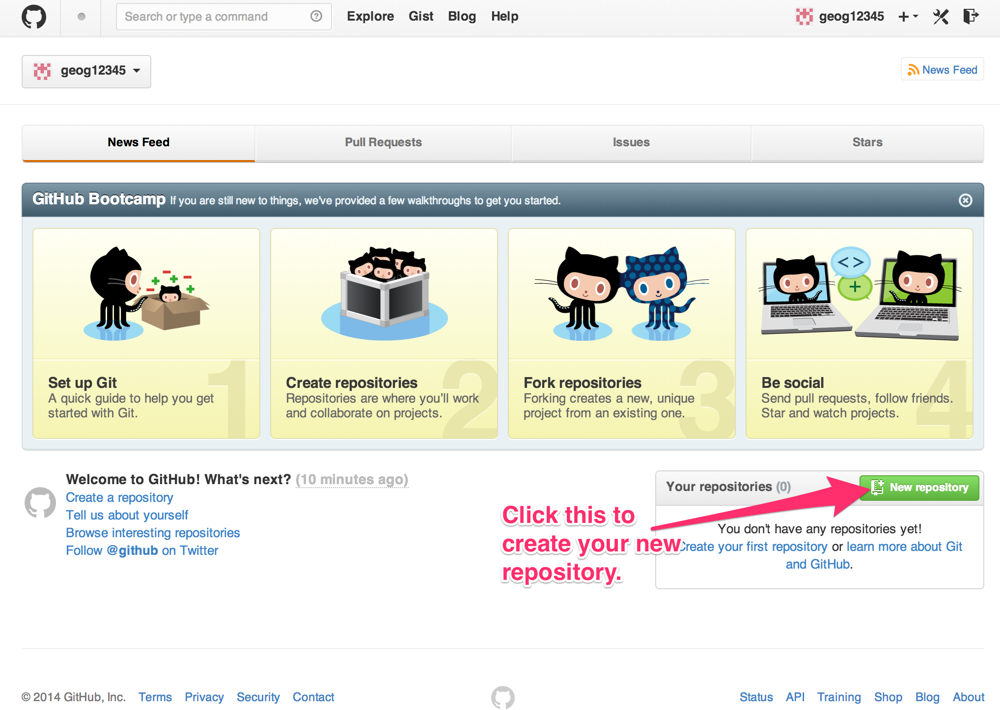

Step 3

:	Click the "Create repository" button near the lower right corner of your dashboard.

Step 4

:	Fill out the information requested for the new repository and click the "Create repository" button near the bottom of the page. 

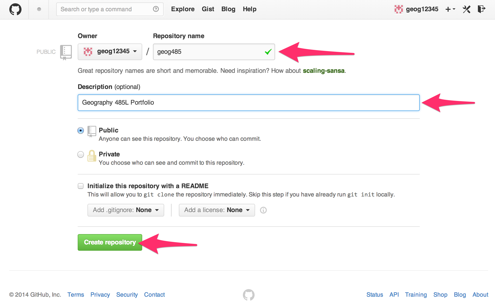

Step 5

:	Create the first file in your repository - a "README" file by clicking on the "README" link provided just under the "Quick Setup" box. When you click this link you will be taken to the editor where you can edit the default README file and "commit" (save) the new/modified file. You will then be taken back to your repository's home page. 

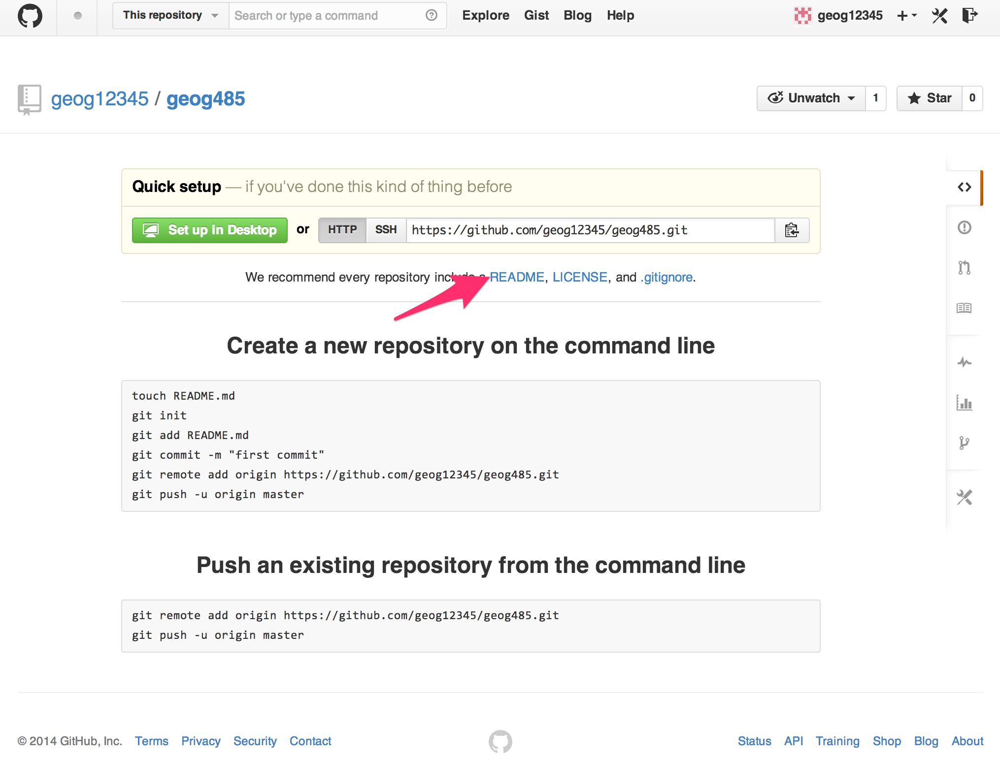

### Create Your First Web Page ###

Step 1

:	From your repository page (shown after completing Step 5 above), click on the "Create a new file here button" 

Step 2

:	Add the information for the new page as shown in the following figure and click the "Commit New File" button to save your changes. 

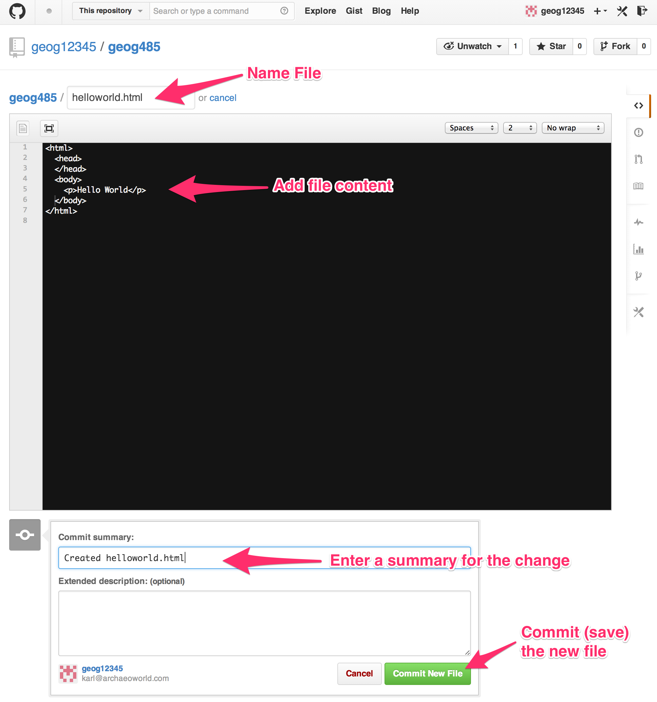

### Make Your New Web Page Visible to the World ###

Step 1

:	Create a new "Branch" from your "Master" branch called "gh-pages". This is a specially named branch of content that GitHub will make available through a specific web address as a web site instead of the standard GitHub interface. 

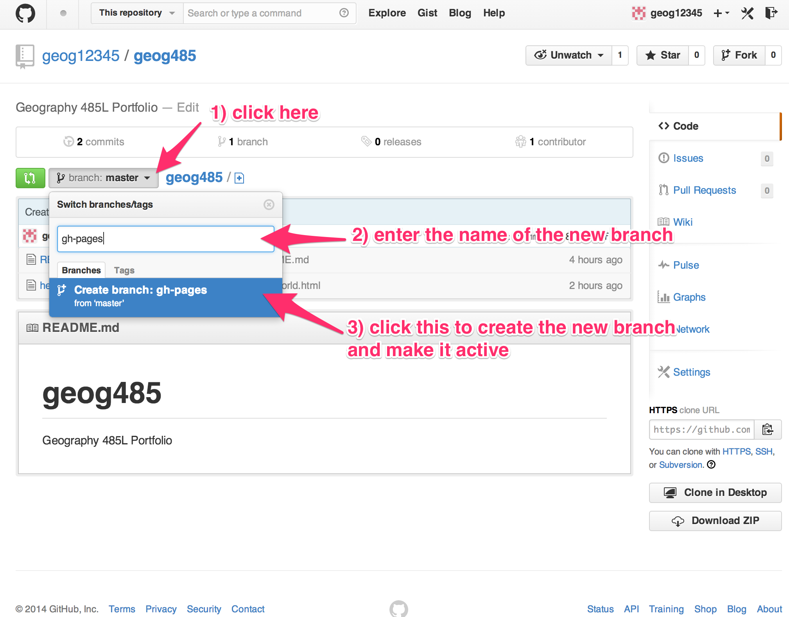

Step 2

:	Test to see if your new page is visible, and looks the way you expect by opening the web address for the page you have in your "gh-pages" branch. This web address is structured like this:

:	`http://<your GitHub username>.github.io/<your repository name>/<the HTML file name>`

:	For example: [http://geog12345.github.io/geog485/helloworld.html](http://geog12345.github.io/geog485/helloworld.html)

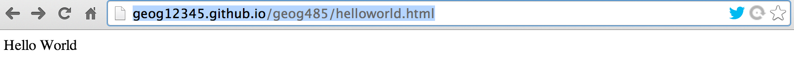

## Week 2 - Create a More Complex Web Page and Style It ##

This week’s milestone activity takes you through the process of creating two more web pages in preparation for next week’s work with the Google Maps API in developing your first web mapping page. These pages will be:

1. A *home page* for your portfolio that will be the access point for all of the materials you create ([template](../examples/homePageTemplate.html)), and
2. Your first web page containing materials related to a *milestone* assignment ([template](../examples/assignmentTemplate.html)).  

Open the *milestone* assignment template linked above and select "view Source" from the browser's menu to view the source code for the file. Create a new document in your GitHub `gh-pages` branch named `milestone_02.html`, copy the page code from the "view source", and paste it into your `milestone_02.html` document. Add your responses to the following questions to the `milestone_02.html` document. 

Open the *home page* template linked above in your web browser and select “view source” from the browser’s menu to examine the source code for the page.

Question 1
:	From examining the display in your web browser and the structure of the source code in the page, what effect (if any) does the white space (i.e. tabs, blank lines, multiple spaces) have on what is displayed in the browser?

Question 2
:  How are the 

		<h1>
and 

		<h2> 

elements from the source code displayed differently in the browser?

Question 3
:	What type of element would you use to create additional list elements in either the “topic” or “data type” lists on the page.

Log into your GitHub account, and create a new document in the `gh-pages` branch and name it `index.html`.

Copy the source code from the “view source” information for the web page you opened in 1) above and paste it into `index.html` document in the GitHub editor. Save your changes

Test your new page by trying the following web addresse (it may take a few minutes for your newly created page to become available):

		http://<your GitHub username>.github.io/<your repository name>
		
		http://<your GitHub username>.github.io/<your repository name>/index.html

Where `<your GitHub username>` is replaced by your username for GitHub, and `<your repository name>` is replaced with the name of the repository that you created your `helloworld.html` document in during last week's milestone exercise.

The reason that the first web address works (without specifying the file name) is that if a file name is not provided in a web address, many web servers will deliver a file named “index.html” if it is found in the requested directory.
 
Flesh out (using using the GitHub *edit* function) the `index.html` page that you created above with information specific to you based upon the content areas in the page. Add a link to your `milestone_02.html` file to the "milestones" section of your `index.html` page. 

Make a copy of your `index.html` page by copying the content of the page and pasting it into a new document named `index_styled.html`.

Experiment with some of the styling capabilities described in Dave Raggett’s “Adding a Touch of Style” page (<http://www.w3.org/MarkUp/Guide/Style.html>) on `index_styled.html` page you created above. Make at least three stylistic changes to the `index_styled.html` page.  

## Week 3 - Creation of a Web Page with an Embedded Google Map ##

In preparation for creating a web page with an embedded Google Map you should first answer the following questions about what and how you want to map. As you define the type of map you want to build, think about a specific problem or topic that you would like to address with your map. 

In this exercise you will be generating the configuration for the base map (i.e. The Google Maps background layers). In  future assignments you will add your own custom content to free-standing web pages that include a mapper based upon the base map you define here.

Create a web page (based upon the assignment [template](../examples/assignmentTemplate.html)) that contains your milestone writeup (including the embedded Google Map required by question 5), and link it to the home page (`index.html`) file you created last week. 

Respond to Question 1-4 with an understanding that you are generating a web page that is publicly accessible, and should be both clear and complete. 

Question 1
:	What area do you want to depict in your map? Why?

Question 2
:	What is the center point (latitude and longitude) of your area of interest?

Question 3
:	What style of map (roads, satellite, hybrid, terrain) is appropriate for your map? Why?

Question 4
:	What is the scale of your map (local, regional, continental, global)? How will this translate into your selection of an appropriate default zoom level for your map?

Now that you have answered these questions about the map that you want to create, refer to the examples in the lecture notes, the Google Maps Tutorial (http://code.google.com/apis/maps/documentation/javascript/tutorial.html), and this week's reading assignment to create a custom Google map.

Question 5
:	Embed a Google Map in your writeup that is based upon your responses to questions 1-4 above.

## Week 4 - Styling of an Embedded Google Map ##

Make a free-standing web page based upon the Google Map that you created as part of last week's lab assignment. Use the Google [styled maps wizard](http://gmaps-samples-v3.googlecode.com/svn/trunk/styledmaps/wizard/index.html) to define _at least_ three modified base map styles and integrate the JSON generated by the wizard into your new Google Map page. 

## Week 5 - Proj4, GDAL, and OGR ##

This week's milestone concentrates on some command line tools that are useful in working with raster and vector data sets. These tools should be available on your personal computers (through the installation of the FW-Tools package for Windows (use the [*mirror site*](http://fwtools.loskot.net/) from the FW-Tools website to download the "FWTools247.exe" package to install on your system), or the GDAL, OGR, and Proj4 frameworks on the Mac) 

Here are some useful links to documentation and information about the tools that you will be working with.

* [FWTools](http://fwtools.maptools.org/)

* [Proj4](http://trac.osgeo.org/proj/) in particular, the following items (from the linked page):
	* The original documentation upon which subsequent documentation is built
		*  [OF90-284.pdf](ftp://ftp.remotesensing.org/proj/OF90-284.pdf) (2.7MB): The main users manual for PROJ; however, this dates from PROJ.3
	* The various addenda that contain some updated command syntax and definitions of additional map projections
		* [proj.4.3.pdf](ftp://ftp.remotesensing.org/proj/proj.4.3.pdf) (1MB)
		* [proj.4.3.I2.pdf](ftp://ftp.remotesensing.org/proj/proj.4.3.I2.pdf) (2MB)
		* [swiss.pdf](ftp://ftp.remotesensing.org/proj/swiss.pdf) (78KB)
	* The key utility programs that you will use
		* [proj](http://trac.osgeo.org/proj/wiki/man_proj)
		* [cs2cs](http://trac.osgeo.org/proj/wiki/man_cs2cs)

* [OGR](http://www.gdal.org/ogr/) in particular the [OGR Utility Programs Documentation](http://www.gdal.org/ogr_utilities.html)

* [GDAL](http://www.gdal.org/) in particular the [GDAL Utility Programs Documentation](http://www.gdal.org/gdal_utilities.html)

Download three data products from one or more of the following online data repositories.

* [New Mexico Resource Geographic Information System](http://rgis.unm.edu/)
* [The US National Atlas Data Download Site](http://nationalatlas.gov/atlasftp.html)
* [NOAA's National Climate Data Center *Climate data online: Data discovery* site](http://www.ncdc.noaa.gov/cdo-web/datasets)

  Make sure to download _at least one vector and one raster_ data product as part of the collection you download. If you need to go to different site(s) to download the data, feel free to do so.

Question 1
:	Briefly describe each dataset based upon the information from the web site.

Question 2
:	Examine each file using either gdalinfo or ogrinfo (depending upon whether it is a raster or vector data product), and answer the following questions about each data set:

* What is the projection/coordinate system for the data product? If it is undefined, note it.

* What is the spatial extent (i.e. bounding box) of the data product?

* If it is a vector dataset, how many features does it have? 

* If it is a raster dataset, what is the pixel resolution (include units) of the dataset?

Question 3
:	Use proj or cs2cs (I suggest you use cs2cs) to calculate the coordinates of the spatial extent of the datasets that you downloaded in UTM Zone 13N, NAD27. Paste the input and output of the command(s) into your writeup.

## Week 6 - WMS & KML ##

As with the previous milestones, please link your web page with your writeup from your homepage in GitHub. 

There are a large number of WMS services available on the web. One way to find interesting services is to search for them using standard search engines such as Google. Try searching for the following search phrase: 

`“REQUEST=GetCapabilities” and “SERVICE=WMS”`

as a single search phrase

Question 1
:	What search engine did you use?

Question 2
:	How many ‘hits’ did you get?

Question 3
:	How useful (generally in terms of getting a pointers to live WMS services [defined as a functioning GetCapabilities request]) were the ‘hits’?

Pick two of the services that included live "GetCapabilities" requests that you found above, and answer the following questions about each.

Question 4 (service #1)
:	What is the URL for the full GetCapabilities request to the service?
:	What is the Name of the service?
:	What Format(s) are available for GetMap requests from the service?
:	How many layers are included in the service (including nesting layers)?

Question 4 (service #2)
:	What is the URL for the full GetCapabilities request to the service?
:	What is the Name of the service?
:	What Format(s) are available for GetMap requests from the service?
:	How many layers are included in the service (including nesting layers)?

Question 5: For one of the layers in the first service, 
:	What is the name of the layer?
:	What is the SRS of the layer?
:	What is the name of the projection that matches the SRS EPSG code?
:	What is the LatLonBoundingBox of the layer?

Open the following GetCapabilities request in your browser. Select “View Source” from the browser menu to see the delivered XML document (it may appear as an unformatted string of text by default in your browser - if that is the case, save the file to your hard drive and view it in a text editor). Use the information in the XML capabilities document to formulate `GetMap` requests for the following map images. Include the requests and resulting images in your write-up. Comment on anything unusual that you notice in the images that are returned. 

[http://gstore.unm.edu/apps/rgis/datasets/92403ebf-aec5-404b-ae8a-6db41f388737/services/ogc/wms?SERVICE=wms&REQUEST=GetCapabilities&VERSION=1.1.1](http://gstore.unm.edu/apps/rgis/datasets/92403ebf-aec5-404b-ae8a-6db41f388737/services/ogc/wms?SERVICE=wms&REQUEST=GetCapabilities&VERSION=1.1.1)

Question 6
:	for the area surrounding Bernalillo County (-107.2,34.7,-106,35.25) as a 200x200 pixel JPEG
:	for the same area as a 500x500 pixel PNG

Open the following (linked) KML file in Google Earth, uncompress it, and save the contained KML file on your computer. Open the KML file in a text editor (e.g. Text Wrangler [Mac], Notepad/Notepad++ [Windows]). 

[http://rgis.unm.edu/gstore/datasets/3f0a85aa-b7f8-47bd-8db6-1c0e66becf72/nm_state_bdy_00.derived.kml](http://rgis.unm.edu/gstore/datasets/3f0a85aa-b7f8-47bd-8db6-1c0e66becf72/nm_state_bdy_00.derived.kml)

Question 7
: Add a second _Placemark_ element to the KML file that represents a _square_ region that is completely contained within the state boundary. Save the KML file and open it in Google Earth (download from http://www.google.com/earth/index.html) or view it in Google Maps (by adding it to your GitHub `gh-pages` branch) as demonstrated in the lecture to verify that you have successfully created the file. Submit the KML file (as a link in your writeup) as part of your writeup for the milestone. 

## Week 7 - WMS GetMap Requests, Map Scale and Aspect Ratio Calculations ##

You might have noticed in the WMS requests that you generated in the previous lab returned images that didn’t look “quite right” relative to what you may know of the shape of familiar features. 

For example, a WMS request for a 200x200 pixel PNG file for an area surrounding Bernalillo County (-107.2,34.7,-106,35.25) from the previous lab would be ([link](http://gstore.unm.edu/apps/rgis/datasets/97810/services/ogc/wms?VERSION=1.1.1&SERVICE=WMS&REQUEST=GetMap&BBOX=-107.2,34.7,-106,35.25&LAYERS=2007fe_35_county00&FORMAT=image/png&TRANSPARENT=TRUE&STYLES=&SRS=EPSG:4326&WIDTH=200&HEIGHT=200)):

	http://gstore.unm.edu/apps/rgis/datasets/92403ebf-aec5-404b-ae8a-6db41f388737/
	services/ogc/wms?VERSION=1.1.1&SERVICE=WMS&REQUEST=GetMap&BBOX=-107.2,34.7,-106,35.25&
	LAYERS=2007fe_35_county00&FORMAT=image/png&TRANSPARENT=TRUE&STYLES=&
	SRS=EPSG:4326&WIDTH=200&HEIGHT=200

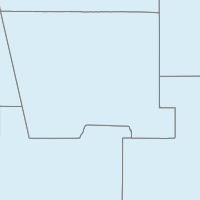 \ 

this request results in a map image that does not agree with the standard shape of Bernalillo county (depicted in the Google Map below) that we are accustomed to, regardless of the specific map projection being used.
	
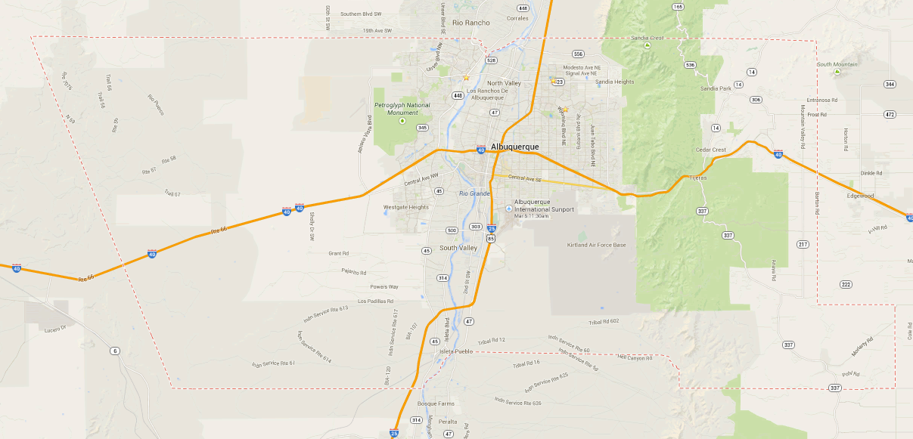 \ 

This discrepancy is the result of a difference in the aspect ratio of the requested BBOX (-107.2,34.7,-106,35.25) and the requested image dimensions (200x200 pixels). _When you compose a WMS GetMap request, you need to make sure that the aspect ratio of both the image size and BBOX match._ 

For example, if we calculate the aspect ratio of the BBOX we obtain the following values (remember that the BBOX is specified as a comma separated list of x,y coordinates: minx,miny,maxx,maxy):

	BBOX width = (maxx) - (minx) = (-106) - (-107.2) = 1.2 degrees
	BBOX height = (maxy) - (miny) = (35.25) - (34.7) = 0.55 degrees
	BBOX aspect ratio = (BBOX width) / (BBOX height) = (1.2) / (0.55) = 2.1818

If we want to retrieve a map image that is 200 pixels wide, we need to calculate an image height that yields an aspect ratio that matches the BBOX aspect ratio. Harking back to basic algebra:

	width = 200
	aspect ratio = width / height = 200 / height = 2.1818
	height = (width) / (aspect ratio) = 200 / 2.1818 = 91.667

So, if we request an image that is 200x92 (we have to request pixel dimensions in integers, so rounding to the nearest integer) we should get a representation that closely approximates the proper shape of features. The modified WMS request with the new images size is the following ([link](http://gstore.unm.edu/apps/rgis/datasets/97810/services/ogc/wms?VERSION=1.1.1&SERVICE=WMS&REQUEST=GetMap&BBOX=-107.2,34.7,-106,35.25&LAYERS=2007fe_35_county00&FORMAT=image/png&TRANSPARENT=TRUE&STYLES=&SRS=EPSG:4326&WIDTH=200&HEIGHT=92)):

	http://gstore.unm.edu/apps/rgis/datasets/92403ebf-aec5-404b-ae8a-6db41f388737/
	services/ogc/wms?VERSION=1.1.1&SERVICE=WMS&REQUEST=GetMap&BBOX=-107.2,34.7,-106,35.25&
	LAYERS=2007fe_35_county00&FORMAT=image/png&TRANSPARENT=TRUE&STYLES=&
	SRS=EPSG:4326&WIDTH=200&HEIGHT=92

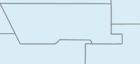 \ 

This process may be reversed to request images of a fixed size for use in a client interface, with the requested BBOX modified to match the aspect ratio of the target image. If, for example, images are being requested for a client interface with a fixed map size of 600x400 pixels, a corresponding BBOX can be derived using the same calculation. 

If, for example, the area of interest for a map is 2 degrees wide, we can calculate the target height (in degrees) using the aspect ratio of the desired image.

	image aspect ratio = (width) / (height) = (600) / (400) = 1.5
	BBOX aspect ratio = (width) / (height) = (2) / (height in degrees) = 1.5
	BBOX height = (width) / (BBOX aspect ratio) = (2) / (1.5) = 1.3333

If our area of interest extends from -106 to -108 degrees East Longitude, we can use the known target height of 1.3333 to generate a WMS BBOX  of the appropriate aspect ratio. If the minimum Latitude of interest is 34.7 degrees North Latitude, the maximum BBOX Y value would be 

	BBOX Max Y = (BBOX Min Y) + (BBOX height) = (34.7) + (1.3333) = 36.0333

This set of calculations may be used to compose the following WMS request ([link](http://gstore.unm.edu/apps/rgis/datasets/97810/services/ogc/wms?VERSION=1.1.1&SERVICE=WMS&REQUEST=GetMap&BBOX=-108,34.7,-106,36.0333&LAYERS=2007fe_35_county00&FORMAT=image/png&TRANSPARENT=TRUE&STYLES=&SRS=EPSG:4326&WIDTH=600&HEIGHT=400)):

	http://gstore.unm.edu/apps/rgis/datasets/92403ebf-aec5-404b-ae8a-6db41f388737/
	services/ogc/wms?VERSION=1.1.1&SERVICE=WMS&REQUEST=GetMap&BBOX=-108,34.7,-106,36.0333&
	LAYERS=2007fe_35_county00&FORMAT=image/png&TRANSPARENT=TRUE&STYLES=&
	SRS=EPSG:4326&WIDTH=600&HEIGHT=400

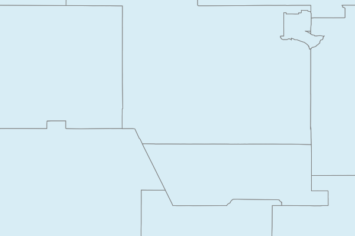 \ 

Given that McKinley County NM is contained within the following BBOX: -109.5, 34.5, -106.5, 36.5

Question 1
:	What is the aspect ratio of this geographic region?

Question 2
:	What would be the height (in whole pixels) for a map image for this region that is 600 pixels wide?

Question 3
:	Formulate a WMS request that reflects the values determined in 1.1 and 1.2 above for the WMS service used above in the examples. Include in your answer both the actual WMS request and the returned map image.
 
Question 4
:	Formulate a WMS request for a 900x600 pixel map image that represents the full 3-degree width of the geographic region, and is based upon the minimum Y value of 34.5 degrees North Latitude. Include in your answer both the WMS request and the returned map image. 

Question 5
:	Given a WMS that is represented by the following GetCapabilities request, formulate _individual_ GetMap requests using the following parameters:

	BBOX=-106.639,35.074,-106.609,35.094
	WIDTH=600
	HEIGHT=400

for each of the following layers: 0 (TNM_Large_Scale_Imagery) and 1 (1_foot_imagery) - *yes - USGS just gave numbers as the layer names*

[Link](http://raster.nationalmap.gov/ArcGIS/services/TNM_Large_Scale_Imagery/MapServer/WMSServer?request=GetCapabilities&service=WMS)

	http://raster.nationalmap.gov/ArcGIS/services/TNM_Large_Scale_Imagery/
	MapServer/WMSServer?request=GetCapabilities&service=WMS 


<!-- http://raster.nationalmap.gov/ArcGIS/services/TNM_Large_Scale_Imagery/MapServer/WMSServer?request=GetMap&service=WMS&VERSION=1.1.0&SRS=EPSG:4326&BBOX=-106.639,35.074,-106.609,35.094&LAYERS=0&FORMAT=image/jpeg&TRANSPARENT=FALSE&STYLES=&WIDTH=600&HEIGHT=400

http://raster.nationalmap.gov/ArcGIS/services/TNM_Large_Scale_Imagery/MapServer/WMSServer?request=GetMap&service=WMS&VERSION=1.1.0&SRS=EPSG:4326&BBOX=-106.639,35.074,-106.609,35.094&LAYERS=0&FORMAT=image/jpeg&TRANSPARENT=FALSE&STYLES=&WIDTH=1200&HEIGHT=800

-->

Question 6
:	Which layers return map images that display image content (i.e. return a non-blank image)? 

Sometimes when WMS layers are accessed, there is a limit on the map scales for which the map image will be returned. If a request is submitted for a map scale that is outside the range specified for a given layer, typically, a blank map image will be returned. 

Questions 7
:	From examining the information for these layers in the GetCapabilities XML document - which element in each layer’s service metadata do you think provides information about the scales for which the layer will return map images containing data?

You can effectively change the scale of a map image by changing the pixel dimensions of the requested image. 

Question 8
:	Which map images contain data for each of the following map image widths (remember to adjust the image height to match the BBOX of the request)
:	30 pixels
:	1200 pixels

## Week 10 - OpenLayers Mapping ##

Following the model used in Milestone 3 for your first Google Map web page, you should first answer the following questions about what and how you want to map - _relating to a different focus than you have used in your previous assignments_. As you define the type of map you want to build, think about a specific problem or topic that you would like to address with your map. 

In this exercise you will be generating the configuration for the base map (i.e. including one or more OpenLayer enabled background layers), adding controls, and defining an appropriate map center and zoom level for the map. You will add your own custom content (i.e. the answers to the following questions) to a free-standing web page that include an interactive mapper and the reasoning behind the design of the map.

Create a web page that contains your milestone assignment writeup (_including_ the embedded OpenLayers map required by question 5), and link it to your home page (index.html). 

Respond to Question 1-4 with an understanding that you are generating a web page that is publicly accessible, and should be, clear, complete, well-formatted, and reasonably styled. 

_Peer Review:_ This week's assignment will include a peer review component. Specifically, 1/3 of your 20-point peer-review score will be based upon _your_ peer-review of _two_ other web pages generated by the students in the class. The required peer-review will consist of two steps:

1. Create a new Discussion Item in Learn entitled: "Page for Peer-Review &lt;Your Name&gt;" at the same time you link your milestone to your homepage. Include in the post the web address of your web page that you created for this assignment. 

2. Provide a _substantive_, _constructive_, and _civil_ comment to _two_ of the posted discussion items posted for peer-review. Please complete the peer-review as soon as possible so that your colleagues can benefit most from your input. Complete the peer-review no later than the required end-of-term portfolio review deadline. Think about the following ideas for your review: _what did I learn from this page_, _what was done well_, _what could be improved_

Question 1
: What area do you want to depict in your map? Why?

Question 2
: What is the center point (latitude and longitude) of your area of interest?

Question 3
:  What base map(s) did you select for use in your map? Why?

Question 4
:  What is the scale of your map (local, regional, continental, global)? How will this translate into your selection of an appropriate default zoom level for your map?

Now that you have answered these questions about the map that you want to create, refer to the examples in the lecture notes, the OpenLayers Examples (http://openlayers.org/dev/examples/), and this week's reading assignment to create a custom OpenLayers map.

Question 5
: Embed the OpenLayers Map in your writeup (included with the answers to questions 1-4 above) that is based upon your responses to questions 1-4 above.

 This work by Karl Benedict is licensed under a <a rel="license" href="http://creativecommons.org/licenses/by-sa/4.0/">Creative Commons Attribution-ShareAlike 4.0 International License</a>.

